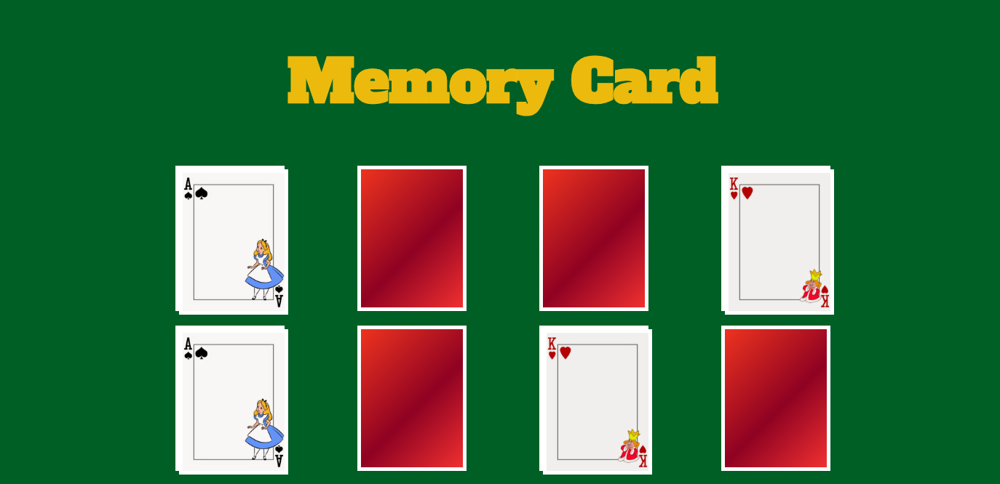

# Memory cards : 

## Introducción :
 
* Este proyecto consiste en implementar un juego que consta de 8 tarjetas en las cuales el usuario debe ir adivinando las posiciones de estas conforme vaya haciendo click.

## Archivos importantes:

* `README.md` con descripción del proyecto e imagenes del mismo.

* `HomePage.js` que contiene el estado inicial de la aplicación.

* `HomePage.css` que contiene los estilos del proyecto.

## Imagen del proyecto : 

